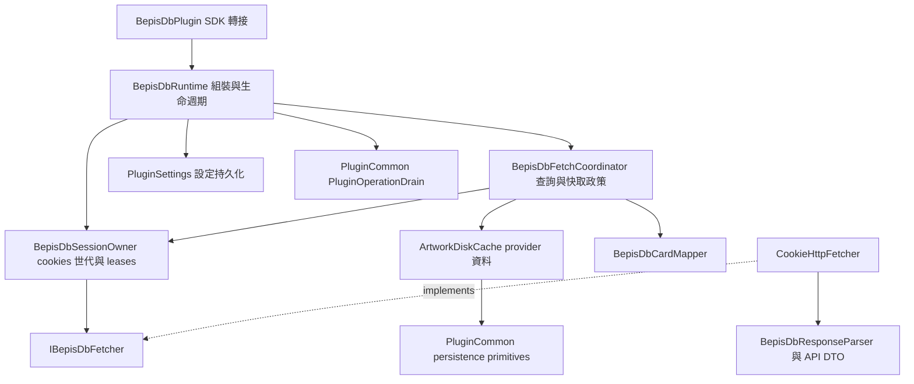

# BepisDB 插件架構

此插件使用 `SceneGallery.PluginSdk 1.3.0` 套件，保持原有公開能力與單 DLL 部署；SDK runtime assembly identity 仍為 `1.0.0.0`，由宿主提供唯一實體。新增功能應沿既有分層擴充；不建立跨 provider 的通用基底類別。所有 implementation type 都是 internal，只有 `BepisDbPlugin` 對 host 公開。

## 依賴與責任

| 邊界 | 應負責的內容 | 禁止承擔的內容 |
| --- | --- | --- |
| `BepisDbPlugin` | SDK capability、名稱/版本、呼叫轉接 | HTTP、JSON、cache dictionaries、關閉狀態機 |
| `BepisDbRuntime` | 組裝、設定鎖、operation admission、唯一 shutdown owner | 解析 API body、provider mapping |
| `BepisDbFetchCoordinator` | artwork 去重、預覽轉存、從快取推導作者 | 建立 HTTP transport、保存 SDK host、反向依賴 runtime |
| `BepisDbSessionOwner` | cookie snapshot、世代、lease、transport retirement | HTTP retry、API parsing、快取 schema |
| `CookieHttpFetcher` | HTTP、限速/retry、失敗/Cloudflare 分類 | SDK 轉接、cache 決策、持有 runtime |
| Parser / Mapper | 純解析與 provider→SDK/快取資料轉換 | 網路、runtime、檔案 I/O |
| Cache / Settings | 現有 JSON schema 與 provider 語意 | 反向呼叫 coordinator、HTTP、入口 |

具體依賴由 [ArchitectureTests](SceneGallery.Plugin.BepisDb.Tests/ArchitectureTests.cs) 檢查，包含一般建構、static call、async body 的負例自測；selector 必須選到預期數量，不能靠空集合通過。完整 top-level 型別 inventory 包含本插件根命名空間及其子命名空間，將 adapter、workflow、transport、storage、parser/mapper 明確列出；新增型別必須先決定責任群組，再補對應的依賴限制，不能靠未被 selector 選中來繞過檢查。

## 查詢與 cookies

1. Runtime 對 cache/read/start 的同步區段取得 operation admission；實際共享 producer 另外被追蹤至 mapping 與 cache publish 完成。
2. coordinator 先讀可用 cache；`saveToLocalCache=true` 可直接轉存先前預覽，無須再發請求。無 Title 的舊 cache 必須重新抓取。
3. cache miss 取得目前 session lease。去重 key 是 artwork ID、是否存檔、session generation；只有勝出的 lazy 啟動 producer，未採用的 lease 立即釋放。
4. producer 使用 runtime shutdown token；每個 caller 只對共享 Task 使用 `WaitAsync(callerToken)`。取消一位 caller 不取消其他 caller，也不阻止 producer 落盤。
5. `ApplyCookies` 發布 cookie/user-agent 的獨立 snapshot。舊 transport 先退休，正常情況下等最後 lease 結束才 Dispose；更新 cookies 後的新 miss 不加入舊 generation。
6. 遲到的 challenge 或 validation 不得修改目前 generation 的 setup 狀態。舊 generation 可回傳給原 waiter，但不能覆寫新 cache；只有實際發布到 cache 的結果才能宣稱 `IsSavedLocally=true`。

session 透過 narrow factory `Func<PluginSettings, Action, IBepisDbFetcher>` 建立 transport。callback 代表「此 generation 要重新設定 cookies」，不是全域無條件重設；測試可注入可控制完成時機的 fetcher，無須打真實 API。

## 取消與關閉

`BepisDbRuntime` 是唯一資源 owner。由 source-only `PluginOperationDrain` 關閉 admission、取消 shutdown、使用同一個 10 秒 deadline drain，接著 teardown session transports，最後才 Dispose cache 和 CTS。超時可強制 teardown execution；忽略取消的 producer 若仍未結束，persistence 延後到 execution cleanup 與最後 producer 都終結再處理。

不可在 operation-count lock 或 session lock 內呼叫外部 Dispose。重複 Dispose 不得重複回收 transport。Dispose 後的新查詢、cookies 或設定寫入應拋出 `ObjectDisposedException`。`Completion` 是 runtime 內部的完整清理完成信號；不新增 SDK capability。

入口也保存 disposed 狀態：即使尚未 Initialize 就 Dispose，後續 stateful 呼叫與 Initialize 也必須被拒絕。未 Dispose、尚未 Initialize 的原有 null/false/default/no-op fallback 則保持相容。重複 Initialize 在建立新 runtime 前拒絕，不能替換或遺漏原 owner。

## 相容性與 provider 政策

- Provider ID 固定 `bepisdb`，categories/composite ID 及 URL/資料夾解析規則不改。匿名 uploader 仍映射成 `Anonymous` / `0`；rating 仍為 AllAges。
- 作者資訊只從 artwork cache 推導。BepisDB 沒有獨立 author API，`forceRefresh` 不會因此發新請求。
- 只保留既有 `destinationFolderName` setting key；空值仍表示略過 provider 子資料夾。`UsesRatingFolders=false`。
- `settings.json` 的 camelCase 欄位、`artworks.json` 的原有欄位與 key 不變。不增加資料迁移；既有明文 cookie 可讀，但下一個既有 Save 點轉成有版本前綴的 CurrentUser DPAPI。
- HTTP 404、schema failure、transient failure 不可混為同一種「不存在」。目前不因新失敗建立 artwork 負快取；對歷史 Failed entries 的七天 TTL 保持相容。403/Cloudflare 走 cookie setup 狀態，不能當成負快取。
- 共用 persistence 只負責 generation/debounce/atomic-write/retry/disposal；entry schema、TTL、keys 與邏輯 mutation 留在本 repo。不得改成共享泛型 cache policy。
- SDK `1.3.0` 是 compile-only binary contract，其 assembly identity `1.0.0.0` 不隨套件版號變動；Common/Secrets `0.2.0` 是 internal source-only implementation。發布內容不包含 SDK、Common、host、其他插件或測試 DLL。

## 常見擴充位置

| 需求 | 修改位置與必要驗證 |
| --- | --- |
| Bepis API 欄位變動 | API DTO + ResponseParser + CardMapper；離線 schema/映射測試 |
| HTTP retry / Cloudflare 判斷 | CookieHttpFetcher + 既有 injected-handler 測試 |
| cookies/session 行為 | SessionOwner + PluginLifecycleTests；包含換世代與遲到 callback |
| 預覽、作者推導、快取命中 | FetchCoordinator + preview→save、legacy cache regression |
| 新設定 | SDK setting 定義 + Runtime/PluginSettings；保持舊 JSON 與秘密欄位保護 |
| 關閉流程 | Runtime wiring；共用 primitive 變更應在擁有套件的 repo 完成，先保持既有 producer/deadline 測試 |

變更邊界前在本文件補記決策與相容性理由；跨 repo primitive/SDK 變更需要同步所有 consumer 驗證，不能把 sibling source link 放進插件專案作為捷徑。
